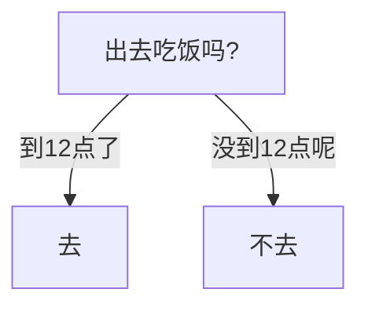
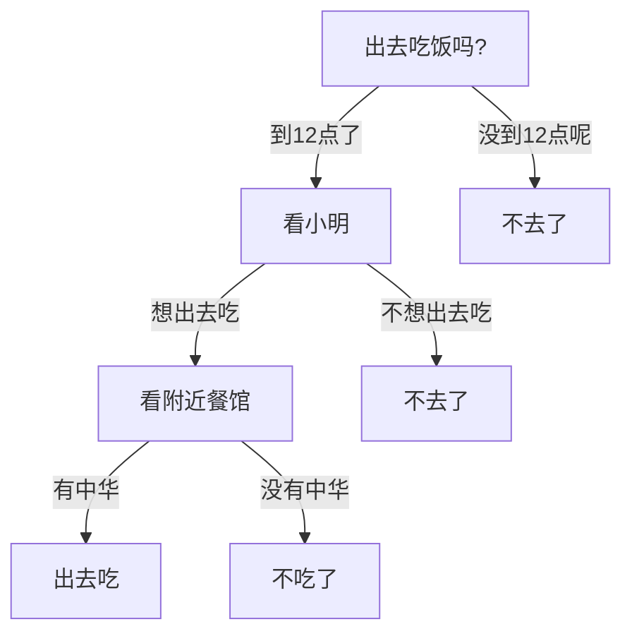
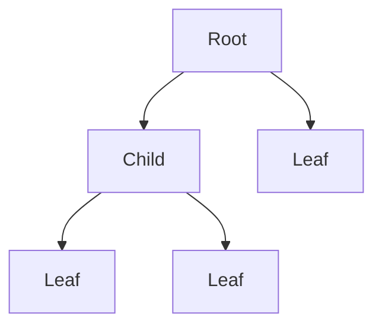

决策树是机器学习当中一系列非常基本的算法, 包括了常见的 ID3, C4.5, CART等等. 决策树学习是根据数据的属性采用树状结构建立的一种决策模型, 并且可以用于解决**分类**和**回归**的问题[^1]. 相对于其他的机器学习算法相比, 决策树背后的数学复杂度并不是很高, 比较容易理解.

# 什么是决策树

可以通过概念去理解决策树. 假设现在要做一个"是否要出去吃午饭"的决定. 用一个图来说明:

以上就是一个非常基本的决策树. 如果加入一些更复杂的因素的话, 决策树也会变得更深. 这里假设"和小明一起去吃中华料理", 图就可以变成这样:

从树的根部开始, 依照当前状况选择路线, 直到做出决定. 因此称之为决策树. 

从定义上看, 决策树是一种树状结构, 自然有树状结构的基本单位, 也就是**节点(Node)**. 而节点与节点之间的连接称为**分支 (branch)**. 结构的开端称为**根 (root)**. 根节点之外的节点称为**子节点 (child)**, 其中特殊的, 没有连接到子节点的节点称为**叶节点 (leaf)**. 绘制出来就是:

这个树状结构是通过训练得到的, 而不是人为生成的. 并且决策树模型非常易于实现, 可解释性强, 也符合人的逻辑. 在决策学习的过程中, 经常会使用 Graphviz, matplotlib 加以可视化(上述的图是用 mermaid画的), 并进行加深理解以便于调整模型.

# 决策学习的过程

决策学习包括了下面三个步骤：

1. 特征选择
2. 决策树生成
3. 决策树修剪

## 特征选择

决策学习的特征选择需要决定使用哪些特征量来做判断, 也就是什么样的特征量可以用来作为树的节点以及节点的排列顺序. 训练数据集中, 属性的个数有很多, 不同的属性用于区分数据的作用有大有小. 因此特征选择的重点就在于, 找到和分类结果相关性较高的特征, 也就是分类能力强的特征.

这些特征能够尽可能地分开数据, 分开的数据尽量的规整(可以说是更**纯**). 一言以蔽之, **将原本无序的数据变得更加有序.** 常用到的衡量指标有三个:

1. 信息增益 (Information Gain)
2. 增益比率 (Gain Ratio)
3. 基尼指数 (Gini Index)

---

### 信息增益 (Information Gain)

上面说了特征选择的重点在于找到分类能力强的特征量. 分类能力强指, 知道了一个特征的属性之后, 就可以最大程度上做出决定了.

用上述的吃饭的例子来说, "现在的时刻"这个特征量一旦确定它是"是12点前"这个属性, 就可以做出"不去吃饭"这个决定了. **"现在的时刻"这个特征量含有了最丰富的信息量, 知道了它的内容, 离做决定就差不多了.** 

那么在信息论中, 什么东西可以量化原本数据的信息量呢? 答案就是**熵 (Entropy)**. 在"现在的时刻是12点前"这个条件之下信息量是**条件熵 (Conditional Entropy)**. 而**信息增益 = 熵 - 条件熵**. 

>  信息增益大就表示, 这个特征量一旦属性确定之后, 能够消除掉很大的不确定性, 说明该特征量越重要.

这样特征选择的问题就变成了"**找到信息增益大的特征量**"了.

*(可以跳过)* 来看数学上的定义:

假设 $X$ 是一个取有限个值的离散随机变量, 其概率分布为

$$
P(X=x_i) = p_i\qquad i=1,2,\dots,n\notag
$$

则随机变量 $X$ 的熵定义为

$$
H(X)=-\sum_{i=1}^np_i\log p_i\notag
$$

熵越大代表随机变量的不确定性就越大.

设有随机变量 $(X, Y)$ , 其联合概率分布为

$$
P(X=x_i, Y=y_j) = p_{ij}\qquad i=1,2,\dots,n; j=1,2,\cdots,m\notag
$$

条件熵 $H(Y\|X)$ 表示在已知随机变量 $X$ 的条件下随机变量 $Y$ 的不确定性， 定义为

$$
H(Y|X)=\sum_{i=1}^n p_iH(Y|X=x_1)\qquad (p_i=P(X=x_i), i=1,2,\dots,n)\notag
$$

实际计算中, 上述的两个熵都是由数据估计(最大似然估计)出来的, 因此都是经验熵. 在这两个值都得到的基础上, 可以定义信息增益. 特征 $A$ 对训练数据集 $D$ 的信息增益 $g(D, A)$ 为集合 $D$ 的经验熵 $H(D)$ 与特征 $A$ 给定条件下 $D$ 的经验条件熵 $H(D\|A)$ 之差, 即

$$
g(D,A)=H(D)-H(D|A)\notag
$$

### 增益比率 (Gain Ratio)

如果只是用上述的信息增益的话, 会产生一个问题, 信息增益的大小是相对于一个特定的训练数据集和特征量的. 如果熵 $H(D)$ 本身就很大, 信息增益也会很大. 例如有一个ID的特征量, 因为ID本身就是独一无二的, 一旦确定之后决策也就确定了, 单看信息增益会得到很大的值. 而原因是拥有ID的数据本来熵就很大 (就是 $H(D)$ 很大), 利用这个特征分类出来的子集的信息熵基本为0, 因此计算出来的信息增益自然很大. 但是显然这是没有意义的特征; 另外, 还有类别取值较多的特征比取值较少的特征信息增益大等问题.

因此, 需要一个相对的值来进行校正, 这就导入了**信息增益比**:

$$
g_R(D,A)=\frac{g(D,A)}{H_A(D)}\notag
$$

$H_A(D)$ 为特征 $A$ 的属性熵, 也叫特征熵:

$$
H_A(D) = -\sum\limits_{i=1}^{n}\frac{|D_i|}{|D|}\log\frac{|D_i|}{|D|}\notag
$$

### 基尼指数 (Gini Index)

上面的信息增益或者是增益比率中涉及到信息熵的运算, 因此含有大量的对数运算. 为了简化运算同时保留信息熵的特点, 引入了基尼指数 (Gini Index) 也叫基尼不纯度. 基尼不纯度的定义为

$$
Gini(p) = \sum_{k=1}^{K}p_k(1-p_k) = 1-\sum_{k=1}^{K}p_k^2\notag
$$

$k$ 为数据集 $D$ 中类别的个数, $p_k$ 表示某种类型出现的概率. 从式子本身的意义来看, 反映了从 $D$ 中随机抽取两个样本, 其类别不一致的概率. 因此, 这个值越小表示数据的纯度越高 (不纯度越低). 数据集 $D$ 的基尼指数为

$$
Gini(D) = 1- \sum_{k=1}^K \left(\frac{|C_k|}{|D|}\right)^2\notag
$$

而对于一个特定的特征 $A$, 假设其可以分为 $D_1$ 和 $D_2$ 两个子集, 则其基尼指数为

$$
Gini(D, A)=\frac{|D_1|}{|D|}Gini(|D_1|) + \frac{|D_2|}{|D|}Gini(|D_2|)\notag
$$

在特征选取中, 和信息增益或者增益比不同的是, 优先选择基尼指数**小**的特征. 这个值被CART算法用于生成决策树, 既可以作为分类也可以作为回归的模型.

---

## 决策树生成

有了上述的指标之后, 可以开始生成决策树. 以信息增益作为例子来看, 从根节点开始, 首先选择信息增益最大的特征作为节点特征, 然后根据特征的不同取值建立子节点. 然后再对于每个子节点进行相同的处理 (计算最大信息增益 ⇒ 建立子节点), 直到最终特征的信息增益很小 (这里需要设置一个信息增益的阈值, 以防止树变得太过于复杂) 或者没有特征可以选择为止.

---

具体的构建决策树的算法有 ID3, C4.5 和 CART.

### ID3 算法

输入: 训练数据集 $D$, 特征集 $A$, 阈值 $\epsilon$  
输出: 决策树 $T$  
步骤:  
1. 若 $D$ 中所有实例输入同一类 $C_k$, 则 $T$ 为单节点树, 并将类 $C_k$ 作为该节点的类标记, 返回 $T$; (只有一个类的情况)
2. 若 $A=\varnothing$ , 则 $T$ 为单节点树, 并将 $D$ 实例数最大的类 $C_k$ 作为该节点的类标记, 返回 $T$; (没有特征量的情况)
3. 否则, 计算 $A$ 中各个特征对于 $D$ 的信息增益, 选择信息增益最大的特征 $A_g$;
4. 如果 $A_g$ 的信息增益小于阈值 $\epsilon$, 则置 $T$ 为单节点树, 并将 $D$ 中实例数最大的类 $C_k$ 作为该节点的类标记, 返回 $T$; 
5. 否则, 对 $A_g$ 的每一个可能值 $a_i$, 依 $A_g = a_i$ 将 $D$ 分割为若干个非空子集 $D_i$, 将 $D_i$ 中实例数最大的类作为标记, 构建子节点, 由节点及其子节点构成树 $T$, 返回 $T$;
6. 对于第 $i$ 个子节点, 以 $D_i$ 为训练集, 以 $A-\{A_g\}$ 为特征集, 递归调用步1 ~ 步5, 得到子树 $T_i$, 返回 $T_i$.

### C4.5 算法

输入: 训练数据集 $D$, 特征集 $A$, 阈值 $\epsilon$  
输出: 决策树 $T$  
步骤:  

1. 若 $D$ 中所有实例输入同一类 $C_k$, 则 $T$ 为单节点树, 并将类 $C_k$ 作为该节点的类标记, 返回 $T$; (只有一个类的情况)
2. 若 $A=\varnothing$ , 则 $T$ 为单节点树, 并将 $D$ 实例数最大的类 $C_k$ 作为该节点的类标记, 返回 $T$; (没有特征量的情况)
3. 否则, 计算 $A$ 中各个特征对于 $D$ 的**信息增益比**, 选择信息增益比最大的特征 $A_g$;
4. 如果 $A_g$ 的信息增益比小于阈值 $\epsilon$, 则置 $T$ 为单节点树, 并将 $D$ 中实例数最大的类 $C_k$ 作为该节点的类标记, 返回 $T$; 
5. 否则, 对 $A_g$ 的每一个可能值 $a_i$, 依 $A_g = a_i$ 将 $D$ 分割为若干个非空子集 $D_i$, 将 $D_i$ 中实例数最大的类作为标记, 构建子节点, 由节点及其子节点构成树 $T$, 返回 $T$;
6. 对于第 $i$ 个子节点, 以 $D_i$ 为训练集, 以 $A-\{A_g\}$ 为特征集, 递归调用步1 ~ 步5, 得到子树 $T_i$, 返回 $T_i$.

### CART 算法

输入: 训练数据集 $D$, 基尼指数阈值, 样本个数阈值  
输出: 决策树 $T$  
步骤:

1. 对于当前节点的数据集为 $D$, 如果样本个数小于阈值或者没有特征, 返回 $T$;
2. 计算样本集 $D$ 的基尼系数, 如果基尼系数小于阈值, 返回 $T$;
3. 否则, 计算当前节点现有的各个特征的各个特征值对数据集 $D$ 的基尼系数, 选择基尼系数最小的特征 $A$ 和对应的特征值 $a$, 将数据集分为两个部分 $D1$ 与 $D2$, 同时建立左右两个子节点;
4. 对于子节点递归调用步1 ~ 步3, 得到子树 $T_i$, 返回 $T_i$.

---

## 决策树修剪

经过决策树生成算法得到的决策树对于训练数据具有很高的分类准确性, 但是对于验证数据集却没有那么高. 换言之就是, 产生了过拟合现象. 如同大部分算法过拟合的原因一样, 如果在使用决策树生成算法时过多得考虑正确性的话, 就容易产生过拟合. 所以需要对产生的模型进行简化, 也就是"决策树修剪 (pruning)": 从已经生成的树上裁掉一些子树或者叶节点.

具体的实现方式就是**极小化决策树整体的损失函数**.

---

*(可以跳过)* 再看公式, 首先定义决策树学习的损失函数为

$$
C_\alpha(T)=\sum_{t=1}^{|T|}N_tH_t(T)+\alpha|T|\notag
$$

其中 $T$ 表示树, $\|T\|$ 为其叶节点的个数, $t$ 是树 $T$ 的其中一个叶节点, 该叶节点上由 $N_t$ 个样本点, 其中属于 $k$ 类样本点的共有 $N_{tk}$ , 则

$$
H_t(T)=-\sum_k\frac{N_{tk}}{N_t}\log\frac{N_{tk}}{N_t}\notag
$$

表示第 $t$ 个叶子的熵. 这里的 $\alpha\geq 0$ 是惩罚系数. 将 $H_t(T)$ 带入上式:

$$
\begin{align*}
\sum_{t=1}^{|T|}N_tH_t(T)&=-\sum_{t=1}^{|T|}N_t\sum_k\frac{N_{tk}}{N_t}\log_2\frac{N_{tk}}{N_t}\\
&=-\sum_{t=1}^{|T|}\sum_{k=1}^{K}N_t\log\frac{N_{tk}}{N_t}\\
&=C(T)
\end{align*}
$$

这样原来的式子就成了

$$
C_\alpha(T) = C(T)+\alpha |T|\notag
$$

$C(T)$ 的意义在于每一个叶子节点的**熵值的加权和**, 如果一个节点被分到了不能再分的时候, 它的熵应该为越来越小 , 那么其熵值的加权值应该也等于越来越小. 因此, 一个树分类纯度越高, 熵值加权和 $C(T)$ 就越小. 但是于此同时, 树的复杂度变大就意味着 $\|T\|$ 值变大, 后一项就变大了. 整个式子 $C_\alpha(T)$ 就处在一个动态平衡的状态.

极端情况下, 假设只有一个根节点的时候, 显然损失函数的值也会非常大. 另一种, 当树非常复杂的时候, 前一项基本为 0, 但后一项又变得非常大, 整体的损失函数也会很大. 这中间存在一个极小值的点, 使得损失函数最小. 而决策树修剪就是通过动态删减一些叶子节点, 找到这个极小值.

总结树的修剪算法.

输入: 生成算法产生的整个树 $T$ , 惩罚参数 $\alpha$;  
输出: 修剪后的子树 $T_\alpha$  
步骤:

1. 计算每个节点的经验熵
2. 利用损失函数, 递归地从树的叶节点向上回缩, 找到极小值

在实际算法使用过程中, 会留出一部分数据集作为验证数据集, 用于学习过程中的泛化性评价, 以防止出现过拟合.

---

这样就完成了决策树的建立. 正如一开始所说, 决策树的优点在于, 易于理解和解释, 能够使用工具进行可视化分析. 另外数据集中出现缺失值也不影响树的建立. 其缺点在于容易产生过拟合. 三个算法各自也有其缺点, 比如ID3算法计算信息增益时结果偏向数值比较多的特征等等, 这里暂时不展开.

以上就是对决策树系列算法的一个简单概括, 其中很多细节的地方并不是很周到. 后续会对于 ID3, C4.5 和 CART 三个算法逐个详细解释以及基于 Python 实现.

> 参考文章:
>
> 1. 李航《统计学习方法》
> 2. [机器学习实战（三）——决策树](https://blog.csdn.net/jiaoyangwm/article/details/79525237)
> 3. [决策树 – Decision tree](https://easyai.tech/ai-definition/decision-tree/)
> 4. [决策树算法原理(下)](https://www.cnblogs.com/pinard/p/6053344.html)

[^1]: 这篇文章只考虑分类的情况, 决策树回归的内容会另外整理一篇.