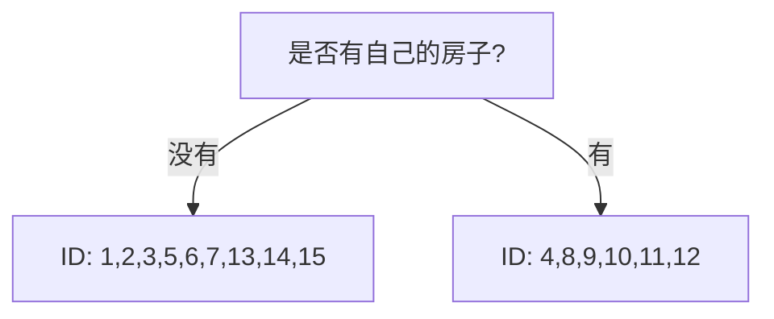
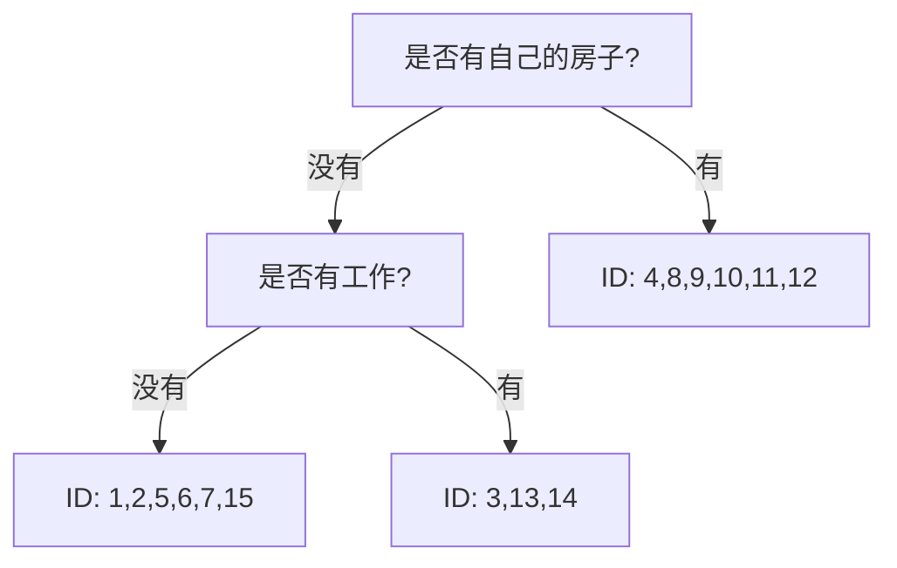
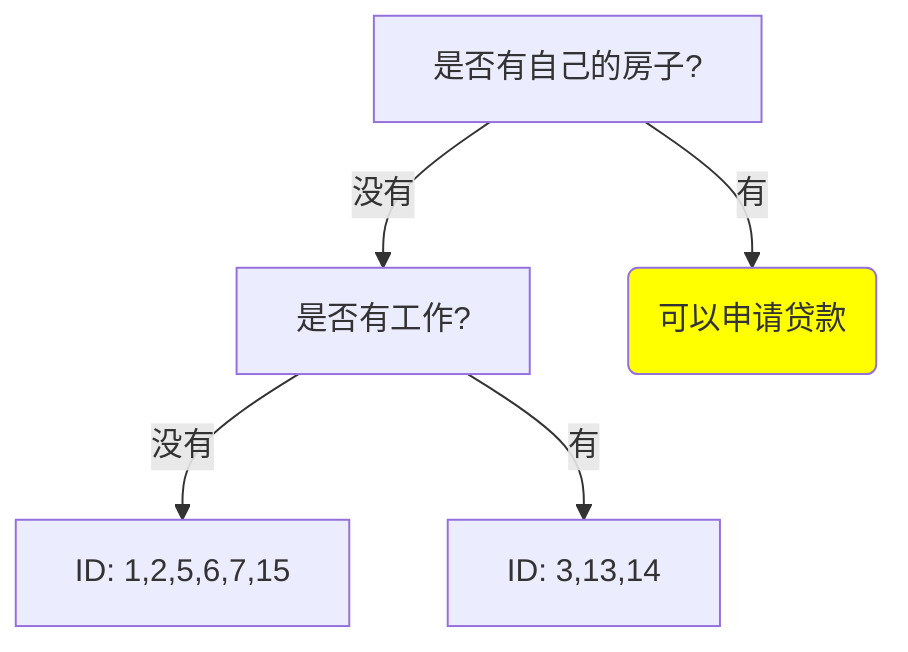
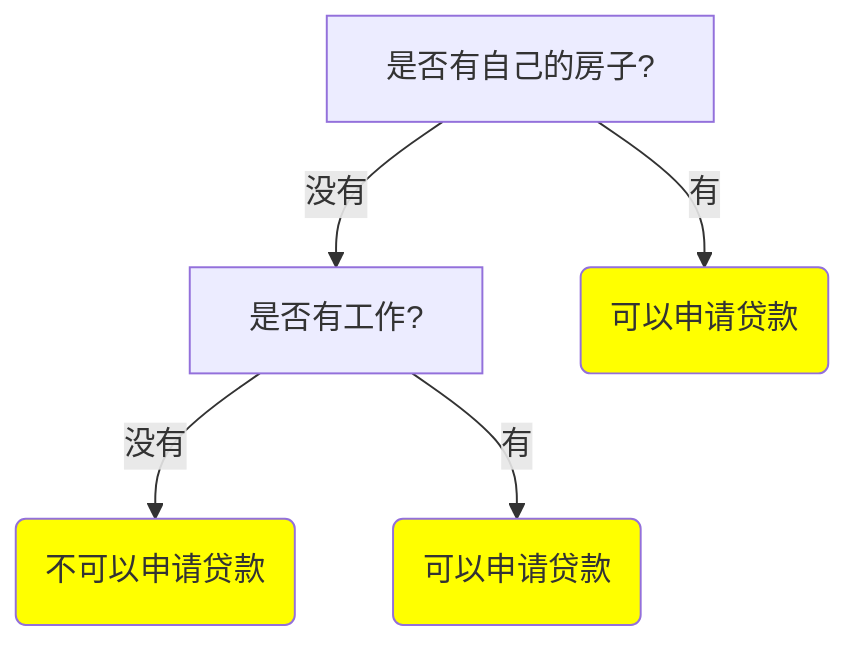

在上一篇文章<[机器学习算法系列 - 决策树(序)]()>中介绍了三个决策学习的算法,  ID3, C4.5, CART. 这一篇文章对 ID3 作深一点的介绍, 并且基于 Scratch Python 以及 Scikit-learn 包进行实现. 

# ID3 的再介绍

ID3 全称是 Iterative Dichotomiser 3 (迭代二叉树 3 代), 是由 [Ross Quinlan](https://en.wikipedia.org/wiki/Ross_Quinlan) 发明的用于决策树的算法. 该算法基于信息熵和信息增益的概念, 能够生成用于分类的决策树. 其算法的语言描述为:

## 描述

1. 从根节点开始, 对节点计算所有可能的特征的信息增益;
2. 选择信息增益最大的特征作为节点的特征, 构建子节点;
3. 对子节点递归调用上述方法, 构建决策树;
4. 直到所有特征的信息增益均很小 (可用事前决定的阈值进行判断) 或者没有特征可以选择

## 步骤

输入: 训练数据集 $D$, 特征集 $A$, 阈值 $\epsilon$  
输出: 决策树 $T$  
步骤:  

1. 若 $D$ 中所有实例输入同一类 $C_k$, 则 $T$ 为单节点树, 并将类 $C_k$ 作为该节点的类标记, 返回 $T$; (只有一个类的情况)
2. 若 $A=\varnothing$ , 则 $T$ 为单节点树, 并将 $D$ 实例数最大的类 $C_k$ 作为该节点的类标记, 返回 $T$; (没有特征量的情况)
3. 否则, 计算 $A$ 中各个特征对于 $D$ 的信息增益, 选择信息增益最大的特征 $A_g$;
4. 如果 $A_g$ 的信息增益小于阈值 $\epsilon$, 则置 $T$ 为单节点树, 并将 $D$ 中实例数最大的类 $C_k$ 作为该节点的类标记, 返回 $T$; 
5. 否则, 对 $A_g$ 的每一个可能值 $a_i$, 依 $A_g = a_i$ 将 $D$ 分割为若干个非空子集 $D_i$, 将 $D_i$ 中实例数最大的类作为标记, 构建子节点, 由节点及其子节点构成树 $T$, 返回 $T$;
6. 对于第 $i$ 个子节点, 以 $D_i$ 为训练集, 以 $A-\{A_g\}$ 为特征集, 递归调用步1 ~ 步5, 得到子树 $T_i$, 返回 $T_i$.

# 问题提出

通过一个人的年龄, 工作状况, 是否有房子以及信贷状况等信息预测他能否申请贷款. 数据如下:

| ID   | 年龄 | 有工作 | 有自己的房子 | 信贷状况 | 类别 |
| ---- | ---- | ------ | ------------ | -------- | ---- |
| 1    | 青年 | 否     | 否           | 一般     | 否   |
| 2    | 青年 | 否     | 否           | 好       | 否   |
| 3    | 青年 | 是     | 否           | 好       | 是   |
| 4    | 青年 | 是     | 是           | 一般     | 是   |
| 5    | 青年 | 否     | 否           | 一般     | 否   |
| 6    | 中年 | 否     | 否           | 一般     | 否   |
| 7    | 中年 | 否     | 否           | 好       | 否   |
| 8    | 中年 | 是     | 是           | 好       | 是   |
| 9    | 中年 | 否     | 是           | 非常好   | 是   |
| 10   | 中年 | 否     | 是           | 非常好   | 是   |
| 11   | 老年 | 否     | 是           | 非常好   | 是   |
| 12   | 老年 | 否     | 是           | 好       | 是   |
| 13   | 老年 | 是     | 否           | 好       | 是   |
| 14   | 老年 | 是     | 否           | 非常好   | 是   |
| 15   | 老年 | 否     | 否           | 一般     | 否   |

使用 ID3 算法生成可用于分类的决策树.

# 基于 Python Scratch 的实现

一共有 4 种特征量 `年龄`, `工作状况`, `是否有房子`, `信贷状况`. 

>  其实不能算得上真正的 Scratch, 毕竟用了 Numpy :sweat_smile:

```python
import numpy as np

feature_columns = ["年龄", "是否有工作", "是否有自己的房子", "信贷状况"]
data = np.array(
    [
        ["青年", "否", "否", "一般", "否"],
        ["青年", "否", "否", "好", "否"],
        ["青年", "是", "否", "好", "是"],
        ["青年", "是", "是", "一般", "是"],
        ["青年", "否", "否", "一般", "否"],
        ["中年", "否", "否", "一般", "否"],
        ["中年", "否", "否", "好", "否"],
        ["中年", "是", "是", "好", "是"],
        ["中年", "否", "是", "非常好", "是"],
        ["中年", "否", "是", "非常好", "是"],
        ["老年", "否", "是", "非常好", "是"],
        ["老年", "否", "是", "好", "是"],
        ["老年", "是", "否", "好", "是"],
        ["老年", "是", "否", "非常好", "是"],
        ["老年", "否", "否", "一般", "否"],
    ]
)

X_train = data[:, :-1]
y_train = data[: ,-1]
```

有两个函数需要经常用到, 可以事先定义好.

```python
# 计算 data 数据中, 各个类别出现的概率
def calc_probs(data):
    probs = [sum(data == i) / len(data) for i in np.unique(data)]
    return probs

# 计算 data 的信息熵
def calc_entropy(data):
    _ps = calc_probs(data)
    entropy = sum([-pi * np.log2(pi) for pi in _ps])
    return entropy
```

直接对 `y_train` 计算熵 $H(D)$:

```python
H_D = calc_entropy(y_train)
# => 0.9709505944546686
```

计算并且选择出拥有最大信息增益的特征:

```python
features = [0, 1, 2, 3]
g_max = 0
feature_g_max = 0
for i in features:
    x_feature = X_train[:, i]
    ps = calc_probs(x_feature)
    Hs = [calc_entropy(y_train[x_feature == j]) for j in np.unique(x_feature)]
    H_DA = sum(np.array(ps) * np.array(Hs))
    g = H_D - H_DA
    if g > g_max:
        g_max = g
        feature_g_max = i
print(f"最大信息增益: {g_max}, 对应特征: {feature_g_max}")
# => 最大信息增益: 0.4199730940219749, 对应特征: 2
```

这样第一个循环下来, 就得到了根节点的特征为 2, 也就是 `是否有自己的房子` 这个特征. 这样决策树就变成了这样:



确定了根节点后, 就得到了两个子节点. 就可以再次进入循环确定节点的特征. 比如对于上图中左边的节点, 需要考察的特征为 $A-\{A_g\}$ 也就是除了房子状况之外的3个特征.

```python
# 更新数据
data = data[data[:, feature_g_max] == "否", :]
X_train = data[:, :-1]
y_train = data[: ,-1]
H_D = calc_entropy(y_train)

# 去掉已经用掉的特征
features.remove(feature_g_max)
g_max = 0
feature_g_max = 0
for i in features:
    x_feature = X_train[:, i]
    ps = calc_probs(x_feature)
    Hs = [calc_entropy(y_train[x_feature == j]) for j in np.unique(x_feature)]
    H_DA = sum(np.array(ps) * np.array(Hs))
    g = H_D - H_DA
    if g > g_max:
        g_max = g
        feature_g_max = i
print(f"最大信息增益: {g_max}, 对应特征: {feature_g_max}")
# => 最大信息增益: 0.9182958340544896, 对应特征: 1
```

这样左边的节点就选择了特征 1 也就是 `是否有工作` 作为其特征. 决策树就更新为:



左边的节点可以继续迭代往下生长. 再来看右边的节点.

```python
# 更新数据
data = data[data[:, feature_g_max] == 0, :]
X_train = data[:, :-1]
y_train = data[: ,-1]

print(len(np.unique(y_train)))
# => 1
```

这些 ID 对应的人只有一个类别, 即都是可以申请贷款的, 因此右节点确定为类标记 "1" 之后就结束了. 之后的决策树更新为:



上述的操作按照算法描述可以写在一个迭代函数中 `ID3_tree_generate(data, features, e=0.01)`.

```python
# 计算并返回最大信息增益和特征
def find_best_gain(X_train, y_train, features):
    H_D = calc_entropy(y_train)
    g_max = 0
    feature_g_max = 0
    for i in features:
        x_feature = X_train[:, i]
        ps = calc_probs(x_feature)
        Hs = [calc_entropy(y_train[x_feature == j]) for j in np.unique(x_feature)]
        H_DA = sum(np.array(ps) * np.array(Hs))
        g = H_D - H_DA
        if g > g_max:
            g_max = g
            feature_g_max = i
    return g_max, feature_g_max


# ID3 迭代算法
def ID3_tree_generate(data, features, e=0.01):
    X_train = data[:, :-1]
    y_train = data[:, -1]

    # Step 1
    # 数据都是一个类别时
    if len(np.unique(y_train)) <= 1:
        return np.unique(y_train)[0]

    # Step 2
    # 特征的数量为0时
    if len(features) < 1:
        return np.bincount(y_train).argmax()[0]

    # Step 3
    # 计算最大信息增益和特征
    g_max, feature_g_max = find_best_gain(X_train, y_train, features)

    # Step 4
    # 最大信息增益比阈值小时
    if g_max < e:
        tree = {feature_columns[feature_g_max]: np.bincount(y_train).argmax()}
        return tree

    # Step 5, 6
    # 分类迭代生成子树
    splited_datas = np.unique(data[:, feature_g_max])
    tree = {feature_columns[feature_g_max]: {}}
    for i in splited_datas:
        sub_data = data[data[:, feature_g_max] == i, :]
        sub_features = features.copy()
        sub_features.remove(feature_g_max)
        tree[feature_columns[feature_g_max]][i] = ID3_tree_generate(
            sub_data, sub_features
        )
    return tree
```

最后, 直接调用 `ID3_tree_generate` 生成决策树.

> 本例使用了 dict 存储树

```python
features = [0, 1, 2, 3]
ID3_tree_generate(data, features)
# => {'是否有自己的房子': {'否': {'是否有工作': {'否': '否', '是': '是'}}, '是': '是'}}
```

最终的树就成了:



这样就完成了一个可用于预测的决策树模型了. 单从这个例子的数据看, 可以发现房子和工作才是能否贷款的最主要原因, 和年龄状况/信贷状况没有太大关系. 另外需要注意的是, 因为这里模型非常的简单, 所以没有用到树的修剪, 阈值的设置也没有起到什么作用.

# 基于 Scikit-Learn 的实现

scikit-learn 的 Tree 提供了 `DecisionTreeClassifier` 用于决策学习. 使用同样的数据来实现.

```python
# scikit-learn 需要数字进行处理, 当然也可以使用 OneHotEncoder
data = np.array(
    [
        [1, 0, 0, 1, 0],
        [1, 0, 0, 2, 0],
        [1, 1, 0, 2, 1],
        [1, 1, 1, 1, 1],
        [1, 0, 0, 1, 0],
        [2, 0, 0, 1, 0],
        [2, 0, 0, 2, 0],
        [2, 1, 1, 2, 1],
        [2, 0, 1, 3, 1],
        [2, 0, 1, 3, 1],
        [3, 0, 1, 3, 1],
        [3, 0, 1, 2, 1],
        [3, 1, 0, 2, 1],
        [3, 1, 0, 3, 1],
        [3, 0, 0, 1, 0],
    ]
)

from sklearn.tree import DecisionTreeClassifier

X_train = data[:, :-1]
y_train = data[:, -1]
clf = DecisionTreeClassifier(criterion="entropy")
clf = clf.fit(X_train, y_train)
```

这里特别指定了 `criterion` 为 `entropy` , 是因为 scikit-learn 默认采用了基尼指数作为指标. 可以使用 `pydotplus` 将训练好的树进行可视化.

```python
from IPython.display import Image
import pydotplus
from sklearn.tree import export_graphviz

dot_data = export_graphviz(
    clf,
    out_file=None,
    filled=True,
    rounded=True,
    feature_names=feature_columns,  
    class_names=["能贷款", "不能贷款"],
    special_characters=True,
)
graph = pydotplus.graph_from_dot_data(dot_data)
Image(graph.create_png())
```


可以看出 scikit-learn 得到的树和上面 scratch 得到树是一样的. 最终版的代码在这里 [Github](https://github.com/simcookies/algorithm_implement/blob/master/ml/Decision_Tree_ID3_scratch.ipynb)。到这里, 关于 ID3 简单的实现就结束了.